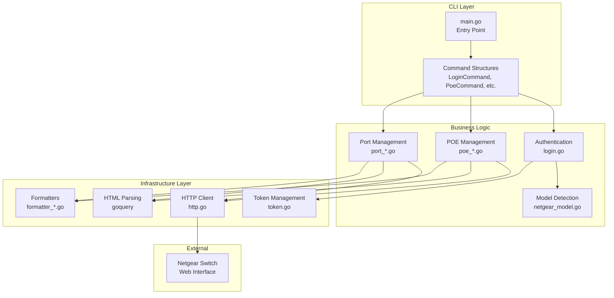
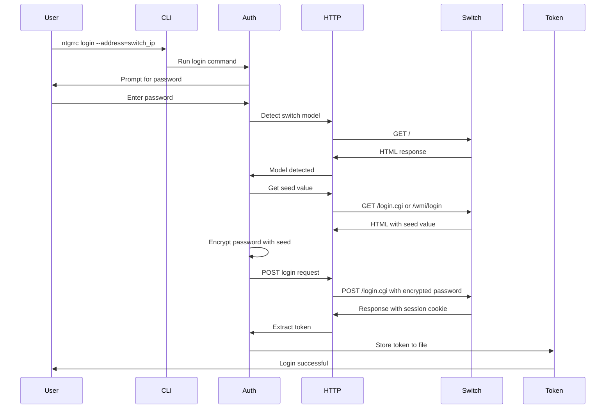
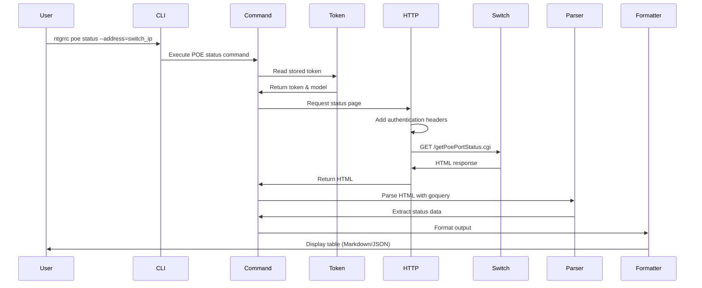
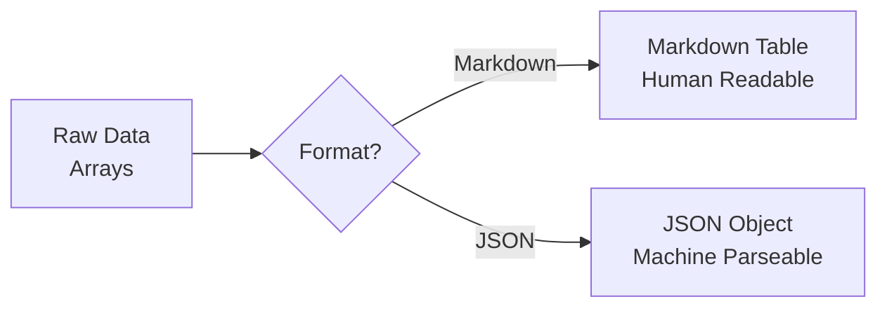
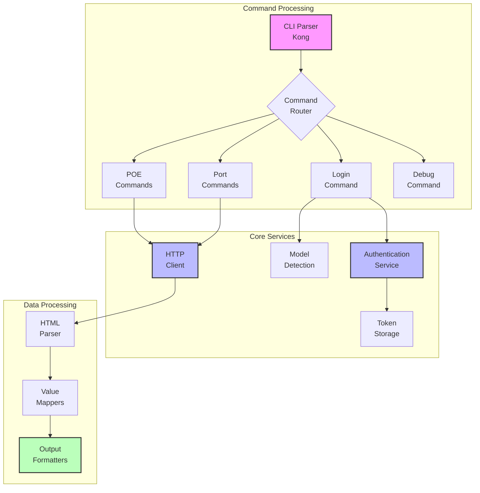
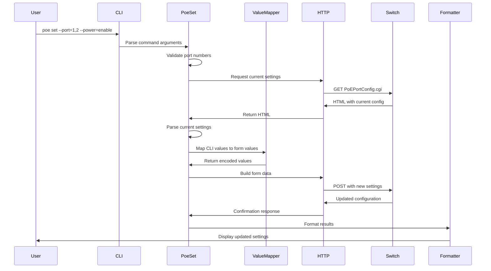
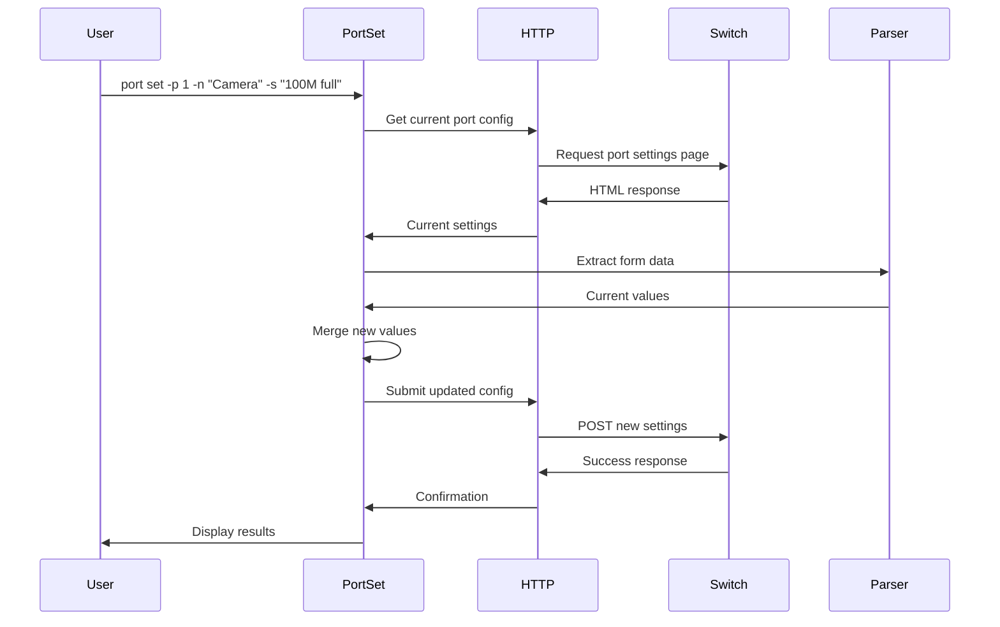
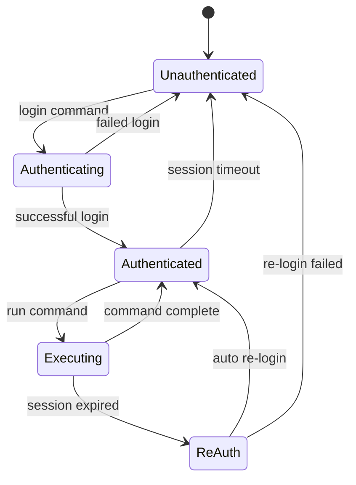

# ntgrrc Design Documentation

## Overview

ntgrrc (Netgear Remote Control) is a command-line interface (CLI) tool designed to manage Netgear managed plus switches in the 300 series. Since Netgear does not provide a REST API for these switches, ntgrrc employs web scraping techniques to interact with the switch's web interface, enabling configuration management and status monitoring.

## Architecture

### Core Components

The application follows a command-based architecture with the following key components:

### Component Descriptions

#### 1. CLI Layer
- **main.go**: Application entry point using Kong library for CLI parsing
- **Command Structures**: Implements command pattern for different operations (login, poe, port, etc.)

#### 2. Authentication & Security
- **login.go**: Handles authentication flow including:
  - Password prompting (with hidden input)
  - Password encryption using MD5 with seed value
  - Session token management
- **token.go**: Manages persistent session tokens for authenticated requests

#### 3. Model Management
- **netgear_model.go**: Detects switch models and provides model-specific behavior
- Supports models: GS305EP(P), GS308EP(P), GS316EP(P)
- Different models have different authentication mechanisms and API endpoints

#### 4. Feature Modules
- **POE Management**: Controls Power over Ethernet settings
  - Status monitoring (poe_status.go)
  - Settings management (poe_settings.go)
  - Port configuration (poe_set_port.go)
  - Power cycling (poe_cycle.go)
- **Port Management**: Controls switch port settings
  - Port settings (port_settings.go)
  - Port configuration (port_set.go)

#### 5. Infrastructure
- **http.go**: HTTP client wrapper with authentication cookie management
- **Formatters**: Output formatting in Markdown (default) or JSON
- **Utilities**: Helper functions for parsing and data manipulation

## Authentication Flow

## Command Execution Flow

## Data Flow

### Model-Specific Behavior

The application handles two main model families differently:

#### GS30x Series (305/308)
- Uses SID cookie for authentication
- Endpoints: `/login.cgi`, `/getPoePortStatus.cgi`, etc.
- Session token in cookie header

#### GS316 Series
- Uses Gambit token in URL parameters
- Endpoints: `/wmi/login`, `/iss/specific/poePortStatus.html`, etc.
- Token embedded in query string

### HTML Parsing Strategy

The tool uses goquery (jQuery-like library for Go) to parse HTML responses:

1. **Status Pages**: Extract data from specific HTML elements
2. **Settings Pages**: Parse form values and configuration
3. **Model Detection**: Analyze page titles and content

### Output Formatting

The formatter system provides flexibility in output:

## Security Considerations

1. **Password Handling**:
   - Passwords are never stored on disk
   - Input is hidden during entry using terminal control
   - Encryption uses switch-provided seed value

2. **Token Management**:
   - Tokens stored in temp directory with predictable naming
   - File-based storage allows parallel sessions
   - No token expiration handling (relies on switch timeout)

3. **Network Communication**:
   - HTTP only (no HTTPS support)
   - No certificate validation
   - Vulnerable to MITM attacks on local network

## Error Handling

The application handles several error scenarios:

1. **Network Errors**: Connection failures, timeouts
2. **Authentication Errors**: Invalid credentials, expired sessions
3. **Parsing Errors**: Unexpected HTML structure
4. **Model Detection Errors**: Unknown switch models

## Extensibility

### Adding New Commands

1. Create command structure with Kong tags
2. Implement Run method
3. Add to CLI struct in main.go
4. Create supporting business logic

### Supporting New Models

1. Add model constant in netgear_model.go
2. Implement model detection logic
3. Add model-specific endpoints
4. Update parsing logic for HTML differences

### Adding Output Formats

1. Define new OutputFormat constant
2. Implement formatter function
3. Add case to format switch statements
4. Update CLI help text

## Limitations

1. **Web Scraping Dependency**: Vulnerable to web interface changes
2. **HTTP Only**: No secure communication option
3. **Limited Feature Coverage**: Only implements subset of switch capabilities
4. **Model-Specific Code**: Requires updates for new firmware/models
5. **No Concurrent Modifications**: Single session per switch

## Module Interaction Diagram

## POE Configuration Workflow

## Port Settings Update Flow

## State Management

## Future Considerations

1. **HTTPS Support**: Add TLS communication options
2. **Configuration Files**: Support for connection profiles
3. **Batch Operations**: Execute multiple commands in sequence
4. **Error Recovery**: Automatic re-authentication on session timeout
5. **Extended Model Support**: Add support for more switch models
6. **API Abstraction**: Create abstraction layer for easier model support