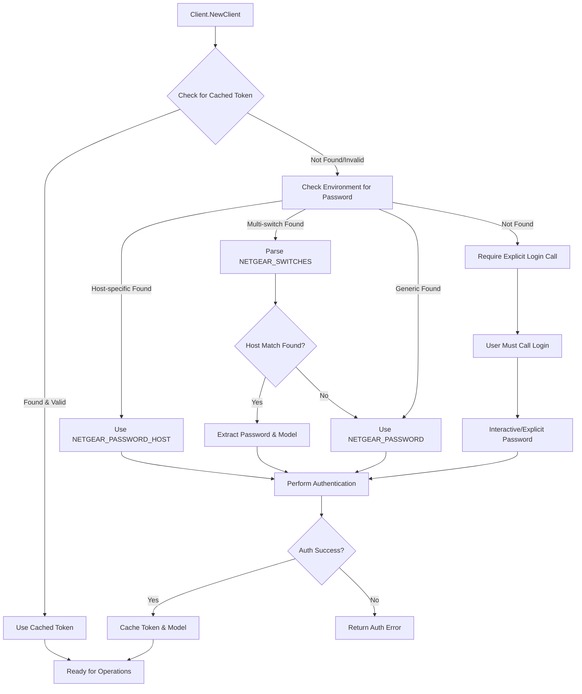

# Library Authentication System Design

## Overview
This document describes the environment variable-based authentication system for the ntgrrc library. This system provides a convenient way to authenticate with Netgear switches using passwords stored in environment variables, eliminating the need for interactive password prompts in automated environments while maintaining token caching for performance.

## Environment Variables

If no environment variable is specified, the login will fail with an error. If a program such as a CLI is using the library, it should provide a way to specify the password via an environment variable.

### Multi-Switch Configuration Variable
- **`NETGEAR_SWITCHES`**: Configure multiple switches in a single variable
- **Format**: `<host1>=<password1>[,<model1>];<host2>=<password2>[,<model2>];...`
- **Note**: Model specification is optional and will be ignored. The library always probes and detects the actual switch model.
- **Examples**:
  - `NETGEAR_SWITCHES=switch1=pass123;192.168.1.10=myPassword;switch3=secret456`
  - `NETGEAR_SWITCHES=switch1=pass123,GS308EPP;192.168.1.10=myPassword,GS305EP` (models ignored)

## Password Resolution Priority

The library will resolve passwords in the following order:

1. **Host-specific environment variable** (highest priority)
   - `NETGEAR_PASSWORD_<normalized-host>`
   - Host normalization: Replace `.` and `:` with `_`, convert to uppercase

2. **Multi-switch configuration variable**
   - Parse `NETGEAR_SWITCHES` for matching host entry
   - Extract password and optional model from `host=password[,model]` format


## Authentication Flow



## Implementation Details

### Environment Password Manager

```go
// EnvironmentPasswordManager handles password resolution from environment variables
type EnvironmentPasswordManager struct {
    verbose bool
}

// NewEnvironmentPasswordManager creates a new environment-based password manager
func NewEnvironmentPasswordManager() *EnvironmentPasswordManager

// SwitchConfig represents a switch configuration from environment variables
type SwitchConfig struct {
    Host     string
    Password string
    Model    string // optional
}

// GetPassword retrieves password from environment variables
func (e *EnvironmentPasswordManager) GetPassword(address string) (string, bool)

// GetSwitchConfig retrieves full switch configuration including optional model
func (e *EnvironmentPasswordManager) GetSwitchConfig(address string) (*SwitchConfig, bool)

// parseMultiSwitchConfig parses NETGEAR_SWITCHES environment variable
func (e *EnvironmentPasswordManager) parseMultiSwitchConfig() (map[string]*SwitchConfig, error)

// normalizeHost converts host to environment variable format
func (e *EnvironmentPasswordManager) normalizeHost(host string) string
```

### Client Integration

```go
// NewClient automatically detects and uses environment passwords for authentication
func NewClient(address string, opts ...ClientOption) (*Client, error) {
    client := &Client{
        address:    address,
        tokenMgr:   NewFileTokenManager(""), // Still use token caching for performance
        passwordMgr: NewEnvironmentPasswordManager(),
        // ... other fields
    }

    // Apply options (may override managers)
    for _, opt := range opts {
        opt(client)
    }

    // Try to load existing cached token first
    ctx := context.Background()
    if token, model, err := client.tokenMgr.GetToken(ctx, address); err == nil {
        client.token = token
        client.model = model
        return client, nil
    }

    // No cached token, check for environment password and config
    if config, found := client.passwordMgr.GetSwitchConfig(address); found {
        // Use model from environment config if available
        if config.Model != "" {
            client.model = Model(config.Model)
        } else {
            // Detect model if not specified in config
            model, err := client.detectModel(ctx)
            if err != nil {
                return nil, err
            }
            client.model = model
        }

        // Perform authentication automatically
        err := client.Login(ctx, config.Password)
        if err != nil {
            return nil, fmt.Errorf("auto-authentication failed: %w", err)
        }
    }

    return client, nil
}

// Login now checks environment variables if no password provided
func (c *Client) Login(ctx context.Context, password string) error {
    // If no password provided, try environment variables
    if password == "" {
        if config, found := c.passwordMgr.GetSwitchConfig(c.address); found {
            password = config.Password
            // Also use model from config if available and not already set
            if config.Model != "" && c.model == "" {
                c.model = Model(config.Model)
            }
        } else {
            return NewAuthError("no password provided and no environment variable found", nil)
        }
    }

    // Continue with existing login logic...
    return c.performLogin(ctx, password)
}
```

## Usage Examples

### Single Switch (Simple)
```bash
# Set password for all switches
export NETGEAR_PASSWORD=myAdminPassword123

# Run commands without password prompts
./poe_status 192.168.1.10
```

### Multiple Switches with Single Variable (Recommended)
```bash
# Configure multiple switches in one variable (passwords only)
export NETGEAR_SWITCHES="switch1=password123;192.168.1.10=myPassword;lab-switch=secret456"

# Or with models specified to skip detection
export NETGEAR_SWITCHES="switch1=password123,GS308EPP;192.168.1.10=myPassword,GS305EP;lab-switch=secret456,GS316EPP"

# Use with different switches - each gets its specific password and model
./poe_status switch1        # Uses password123, model GS308EPP
./poe_status 192.168.1.10   # Uses myPassword, model GS305EP
./poe_status lab-switch     # Uses secret456, model GS316EPP
```

### Mixed Configuration (All Methods)
```bash
# Multi-switch variable (highest priority for listed switches)
export NETGEAR_SWITCHES="prod-switch1=prodPass123,GS308EPP;test-switch=testPass456"

# Host-specific overrides (highest priority)
export NETGEAR_PASSWORD_SPECIAL_SWITCH=specialPassword789

# Generic fallback for unlisted switches
export NETGEAR_PASSWORD=fallbackPassword

# Optional: Individual model specifications
export NETGEAR_MODEL_SPECIAL_SWITCH=GS316EPP

# Resolution examples:
./poe_status prod-switch1     # Uses prodPass123, GS308EPP (from NETGEAR_SWITCHES)
./poe_status test-switch      # Uses testPass456 (from NETGEAR_SWITCHES)
./poe_status special-switch   # Uses specialPassword789, GS316EPP (host-specific)
./poe_status other-switch     # Uses fallbackPassword (generic fallback)
```

### Legacy Support (Backward Compatible)
```bash
# Host-specific passwords (still supported)
export NETGEAR_PASSWORD_192_168_1_10=switch1Password
export NETGEAR_PASSWORD_SWITCH1=switch1Password
export NETGEAR_PASSWORD_SWITCH2=switch2Password
export NETGEAR_PASSWORD=fallbackPassword  # Generic fallback

# Optional: Specify models to skip detection
export NETGEAR_MODEL_192_168_1_10=GS308EPP
export NETGEAR_MODEL_SWITCH1=GS305EP

# Use with different switches
./poe_status 192.168.1.10  # Uses NETGEAR_PASSWORD_192_168_1_10
./poe_status switch1       # Uses NETGEAR_PASSWORD_SWITCH1
./poe_status switch2       # Uses NETGEAR_PASSWORD_SWITCH2
./poe_status switch3       # Uses NETGEAR_PASSWORD (fallback)
```

### CI/CD Integration
```yaml
# GitHub Actions example - Multiple switches in single variable
env:
  NETGEAR_SWITCHES: "testswitch1=${{ secrets.NETGEAR_TEST_PASSWORD1 }},GS308EPP;testswitch2=${{ secrets.NETGEAR_TEST_PASSWORD2 }},GS305EP"

steps:
  - name: Test POE Status on Multiple Switches
    run: |
      ./build/examples/poe_status testswitch1
      ./build/examples/poe_status testswitch2

# GitHub Actions example - Legacy individual variables
env:
  NETGEAR_PASSWORD_TESTSWITCH: ${{ secrets.NETGEAR_TEST_PASSWORD }}
  NETGEAR_MODEL_TESTSWITCH: GS308EPP

steps:
  - name: Test POE Status
    run: ./build/examples/poe_status testswitch
```

### Docker Integration
```dockerfile
# Dockerfile - Multi-switch support
ENV NETGEAR_SWITCHES=""

# docker run - Single variable with multiple switches
docker run -e NETGEAR_SWITCHES="switch1=pass1,GS308EPP;switch2=pass2,GS305EP" myapp

# Legacy approach
ENV NETGEAR_PASSWORD=""
docker run -e NETGEAR_PASSWORD=myPassword myapp ./poe_status switch1
```

### Kubernetes Integration
```yaml
# Secret - Store switch configurations
apiVersion: v1
kind: Secret
metadata:
  name: netgear-config
type: Opaque
stringData:
  switches-config: |
    prod-switch1=secretPassword123,GS308EPP;
    prod-switch2=anotherSecret456,GS305EP;
    backup-switch=backupPass789,GS316EPP

# Deployment - Multi-switch configuration
apiVersion: apps/v1
kind: Deployment
spec:
  template:
    spec:
      containers:
      - name: netgear-app
        env:
        - name: NETGEAR_SWITCHES
          valueFrom:
            secretKeyRef:
              name: netgear-config
              key: switches-config

# Alternative: Individual secrets (legacy support)
apiVersion: v1
kind: Secret
metadata:
  name: netgear-individual-passwords
type: Opaque
stringData:
  switch1-password: myPassword123
  switch2-password: myOtherPassword456

# Deployment with individual variables
apiVersion: apps/v1
kind: Deployment
spec:
  template:
    spec:
      containers:
      - name: netgear-app
        env:
        - name: NETGEAR_PASSWORD_SWITCH1
          valueFrom:
            secretKeyRef:
              name: netgear-individual-passwords
              key: switch1-password
        - name: NETGEAR_PASSWORD_SWITCH2
          valueFrom:
            secretKeyRef:
              name: netgear-individual-passwords
              key: switch2-password
```

## Password Security

### Best Practices
1. **Rotation**: Passwords should be rotated regularly
2. **Scope**: Use host-specific passwords when managing multiple switches
3. **Storage**: Store in secure environment variable systems (Vault, K8s Secrets, etc.)
4. **Logging**: Never log password values (mask in debug output)
5. **Access Control**: Limit access to environment variables containing passwords

### Security Considerations
- Environment variables are visible to the process and its children
- Use secure secret management systems in production (HashiCorp Vault, AWS Secrets Manager, etc.)
- Consider using short-lived tokens in production environments
- Audit password usage and access patterns
- Use encrypted storage for password files if file-based storage is needed

## Error Handling

### Password Validation
- Empty password: Return clear error message indicating missing password
- Invalid password: Return authentication error with retry suggestions
- Network errors during authentication: Retry with exponential backoff

### Fallback Behavior
- If environment password fails authentication, do not fall back to prompting
- If no environment password found, require explicit Login() call with password
- Provide clear error messages about authentication requirements
- Cache successful authentications to avoid repeated login attempts

## Library API Changes

### New Options
```go
// WithEnvironmentAuth enables/disables environment variable password lookup
func WithEnvironmentAuth(enabled bool) ClientOption

// WithPasswordManager sets a custom password manager
func WithPasswordManager(pm PasswordManager) ClientOption

// PasswordManager interface for custom password resolution
type PasswordManager interface {
    GetPassword(address string) (string, bool)
}
```

### Enhanced Login Method
```go
// Login method now supports empty password for environment lookup
func (c *Client) Login(ctx context.Context, password string) error

// New convenience method for automatic authentication
func (c *Client) LoginAuto(ctx context.Context) error
```

### Backward Compatibility
- Existing Login(ctx, password) calls continue to work unchanged
- Environment password lookup is enabled by default
- Explicit password parameter takes precedence over environment variables
- Token caching behavior remains the same for performance

## Configuration Priority

1. **Explicit password parameter in Login()** (highest priority)
2. **Host-specific environment variables** (NETGEAR_PASSWORD_<HOST>)
3. **Multi-switch configuration variable** (NETGEAR_SWITCHES)
4. **Generic password fallback** (NETGEAR_PASSWORD)
5. **Require explicit Login() call** (lowest priority - no automatic prompting)

## Migration Path

### From Interactive Password Auth
```go
// Before: Required password prompt or parameter
client, _ := netgear.NewClient("192.168.1.10")
client.Login(ctx, "myPassword123")

// After: Automatic with environment password
export NETGEAR_PASSWORD_192_168_1_10=myPassword123
client, _ := netgear.NewClient("192.168.1.10")
// Authentication happens automatically during NewClient() if password is available
```

### From Existing Examples
```go
// Before: Examples required NETGEAR_PASSWORD environment variable
password := os.Getenv("NETGEAR_PASSWORD")
client, _ := netgear.NewClient(address)
client.Login(ctx, password)

// After: Automatic lookup with multi-switch support
export NETGEAR_SWITCHES="switch1=pass1,GS308EPP;switch2=pass2,GS305EP"
client, _ := netgear.NewClient(address)
client.Login(ctx, "") // Empty password triggers environment lookup
// Or even simpler:
client, _ := netgear.NewClient(address)
client.LoginAuto(ctx) // Explicit auto-login method

// Still backward compatible with original approach:
export NETGEAR_PASSWORD=myPassword
client, _ := netgear.NewClient(address)
// No Login() call needed - auto-authenticates during NewClient()
```

### From Multiple Individual Variables to Single Variable
```bash
# Before: Multiple individual variables
export NETGEAR_PASSWORD_SWITCH1=password1
export NETGEAR_PASSWORD_SWITCH2=password2
export NETGEAR_PASSWORD_SWITCH3=password3
export NETGEAR_MODEL_SWITCH1=GS308EPP
export NETGEAR_MODEL_SWITCH2=GS305EP

# After: Single consolidated variable
export NETGEAR_SWITCHES="switch1=password1,GS308EPP;switch2=password2,GS305EP;switch3=password3"

# Both approaches work simultaneously for mixed environments
```

## Implementation Phases

### Phase 1: Core Environment Password Manager
- Implement EnvironmentPasswordManager with host normalization
- Add environment variable parsing logic
- Create PasswordManager interface

### Phase 2: Client Integration
- Modify NewClient to attempt auto-authentication with environment passwords
- Add new ClientOption functions (WithEnvironmentAuth, WithPasswordManager)
- Update Login method to support empty password parameter
- Add LoginAuto convenience method

### Phase 3: Documentation and Examples
- Update example programs to demonstrate automatic authentication
- Add documentation and usage examples
- Create migration guides for existing code

### Phase 4: Advanced Features
- Integration with secret management systems (Vault, AWS Secrets Manager)
- Password validation and complexity requirements
- Audit logging for authentication attempts

## Programmatic Environment Variable Setting

### Overview
Programs using the library can set environment variables programmatically using `os.Setenv()` in Go. This is useful for CLI applications that want to bridge user input with the library's environment-based authentication.

### Basic Environment Variable Setting
```go
package main

import (
    "fmt"
    "os"
)

func main() {
    // Set environment variable
    err := os.Setenv("NETGEAR_PASSWORD_SWITCH1", "myPassword123")
    if err != nil {
        fmt.Printf("Failed to set environment variable: %v\n", err)
    }
    
    // Set multi-switch configuration
    switches := "switch1=pass123,GS308EPP;switch2=pass456,GS305EP"
    os.Setenv("NETGEAR_SWITCHES", switches)
    
    // Verify it was set
    value := os.Getenv("NETGEAR_SWITCHES")
    fmt.Printf("NETGEAR_SWITCHES = %s\n", value)
}
```

### CLI Application Integration
```go
package main

import (
    "context"
    "flag"
    "log"
    "os"
    
    "ntgrrc/pkg/netgear"
)

func main() {
    var password string
    flag.StringVar(&password, "password", "", "Switch password")
    flag.Parse()
    
    if password != "" {
        // Set environment variable so library can find it
        os.Setenv("NETGEAR_PASSWORD", password)
    }
    
    // Now use the library - it will find the password in environment
    client, err := netgear.NewClient("192.168.1.10")
    if err != nil {
        log.Fatal(err)
    }
    
    // Library will auto-authenticate using the environment variable
    statuses, err := client.POE().GetStatus(context.Background())
    // ...
}
```

### Dynamic Multi-Switch Configuration
```go
package main

import (
    "fmt"
    "os"
    "strings"
)

type SwitchConfig struct {
    Password string
    Model    string
}

func configureSwitches(switchConfigs map[string]SwitchConfig) {
    var parts []string
    
    for host, config := range switchConfigs {
        var part string
        if config.Model != "" {
            part = fmt.Sprintf("%s=%s,%s", host, config.Password, config.Model)
        } else {
            part = fmt.Sprintf("%s=%s", host, config.Password)
        }
        parts = append(parts, part)
    }
    
    // Set the multi-switch environment variable
    switchesVar := strings.Join(parts, ";")
    os.Setenv("NETGEAR_SWITCHES", switchesVar)
}

func main() {
    // Configure multiple switches dynamically
    switches := map[string]SwitchConfig{
        "switch1":      {Password: "pass123", Model: "GS308EPP"},
        "192.168.1.10": {Password: "secret456", Model: "GS305EP"},
        "lab-switch":   {Password: "labpass789", Model: ""},
    }
    
    configureSwitches(switches)
    
    // Now the library can use any of these switches
    fmt.Println("Environment configured for switches:", os.Getenv("NETGEAR_SWITCHES"))
}
```

### Interactive Password Collection
```go
package main

import (
    "fmt"
    "log"
    "os"
    "strings"
    "syscall"
    
    "golang.org/x/term"
    "ntgrrc/pkg/netgear"
)

func promptAndSetPassword(host string) error {
    fmt.Printf("Enter password for %s: ", host)
    
    // Read password without echoing
    password, err := term.ReadPassword(int(syscall.Stdin))
    if err != nil {
        return err
    }
    fmt.Println() // New line after password input
    
    // Set environment variable for this specific host
    envVar := fmt.Sprintf("NETGEAR_PASSWORD_%s", normalizeHost(host))
    return os.Setenv(envVar, string(password))
}

func normalizeHost(host string) string {
    // Convert host to environment variable format
    normalized := strings.ReplaceAll(host, ".", "_")
    normalized = strings.ReplaceAll(normalized, ":", "_")
    return strings.ToUpper(normalized)
}

func main() {
    host := "192.168.1.10"
    
    // Check if password already exists in environment
    envVar := fmt.Sprintf("NETGEAR_PASSWORD_%s", normalizeHost(host))
    if os.Getenv(envVar) == "" {
        // Prompt for password and set it
        err := promptAndSetPassword(host)
        if err != nil {
            log.Fatal(err)
        }
    }
    
    // Now use the library
    client, _ := netgear.NewClient(host)
    // Auto-authenticates using the environment variable we just set
}
```

### Important Considerations

#### Scope of Environment Variables
- `os.Setenv()` only affects the **current process** and its **child processes**
- It does **NOT** affect the parent shell or other processes
- The variable persists for the lifetime of the current program

#### Security Best Practices
```go
// Clear sensitive environment variables when done
defer func() {
    os.Unsetenv("NETGEAR_PASSWORD")
    os.Unsetenv("NETGEAR_SWITCHES")
    
    // Clear all host-specific passwords
    for _, env := range os.Environ() {
        if strings.HasPrefix(env, "NETGEAR_PASSWORD_") {
            key := strings.Split(env, "=")[0]
            os.Unsetenv(key)
        }
    }
}()
```

#### CLI Application Pattern
This approach is ideal for CLI applications that need to:
1. Accept passwords via command line flags or interactive prompts
2. Set them as environment variables internally
3. Let the library handle authentication automatically
4. Clear sensitive data when done

The CLI acts as a bridge between user input methods and the library's environment variable expectations.

## Testing Strategy

### Unit Tests
- Environment variable parsing and normalization
- Password resolution priority testing
- PasswordManager interface implementations
- Client auto-authentication logic
- Programmatic environment variable setting and clearing

### Integration Tests
- End-to-end authentication with environment passwords
- Multi-switch scenario testing with different passwords
- Token caching behavior with password-based auth
- Error condition handling and fallback behavior
- CLI integration with programmatic variable setting

### Security Tests
- Password masking in logs and debug output
- Environment variable isolation testing
- Authentication failure handling
- Token security after password-based authentication
- Proper cleanup of sensitive environment variables
