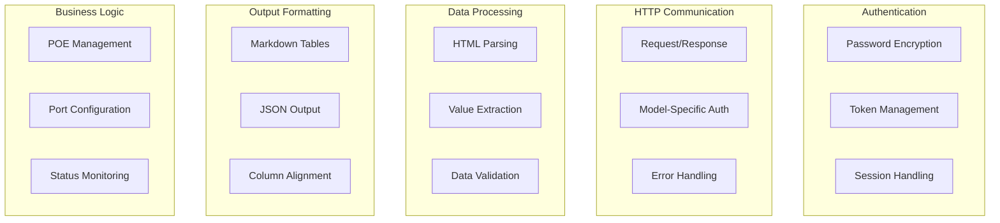

# Testing Strategy for ntgrrc

## Overview

This document outlines the comprehensive testing strategy for ntgrrc, including unit tests, integration tests, and testing utilities. The test suite ensures the reliability, correctness, and maintainability of the codebase.

## Test Architecture

### Test Files Structure

```
ntgrrc/
├── test_utils.go                        # Testing utilities and mocks
├── *_test.go                           # Unit tests for specific modules
├── *_comprehensive_test.go             # Comprehensive unit tests  
├── integration_test.go                 # End-to-end integration tests
└── test-data/                         # Test fixtures and mock data
    ├── GS305EP/
    ├── GS308EPP/
    ├── GS316EP/
    └── GS316EPP/
```

### Test Categories

1. **Unit Tests**: Test individual functions and components in isolation
2. **Integration Tests**: Test complete workflows and component interactions  
3. **Mock Tests**: Test with simulated HTTP responses and switch behavior
4. **Edge Case Tests**: Test error conditions and boundary cases
5. **Performance Tests**: Verify response times and resource usage

## Test Utilities

### MockHTTPServer

The `MockHTTPServer` in `test_utils.go` provides a comprehensive mock implementation:

```go
type MockHTTPServer struct {
    server       *httptest.Server
    model        NetgearModel
    sessionToken string
    gambitToken  string
    requests     []RequestLog
}
```

**Features:**
- Simulates different Netgear switch models (GS305EP, GS316EP, etc.)
- Model-specific authentication (SID cookies vs Gambit tokens)
- Request logging for verification
- Realistic HTML responses based on test data
- Authentication validation

**Usage:**
```go
mock := NewMockHTTPServer(GS305EP)
defer mock.Close()

// Use mock.URL() for requests
// Use mock.GetRequests() to verify interactions
```

### Test Helper Functions

- `createTestGlobalOptions()`: Creates configured test options
- `createTempTokenDir()`: Creates temporary directories for token storage
- `writeTestToken()`: Sets up authentication tokens for tests
- `captureOutput()`: Captures stdout for output verification

## Unit Tests

### Core Component Tests

#### Authentication Tests (`login_test.go`)
- Password encryption with seed values
- HTML parsing for seed extraction
- Gambit token extraction
- Model-specific login flows

#### Model Detection Tests (`netgear_model_comprehensive_test.go`)
- Model classification functions (`isModel30x`, `isModel316`)
- HTML-based model detection
- HTTP response parsing
- Error handling for unknown models

#### Token Management Tests (`token_comprehensive_test.go`)
- Token storage and retrieval
- File permissions (0600)
- Directory creation
- Concurrent access
- Malformed file handling
- Token file path generation

#### HTTP Client Tests (`http_test.go`)
- Authenticated and unauthenticated requests
- Model-specific authentication headers
- Error propagation
- Cookie vs URL parameter auth methods

#### POE Status Tests (`poe_status_comprehensive_test.go`)
- HTML parsing for different models
- Status data extraction
- Authentication requirement checks
- Output formatting (Markdown/JSON)

#### Formatter Tests (`formatter_test.go`)
- Markdown table generation
- Column alignment and spacing
- JSON object creation
- Unicode character handling
- Empty data handling

### Test Coverage Areas



## Integration Tests

### Complete Workflow Tests (`integration_test.go`)

#### Login Workflow
```go
func TestCompleteLoginWorkflow(t *testing.T)
```
- Model detection
- Authentication
- Token storage
- Subsequent authenticated requests

#### POE Management Workflow
```go
func TestPOEManagementWorkflow(t *testing.T)
```
- Status retrieval
- Settings management
- Configuration updates
- Power cycling

#### Port Management Workflow
```go
func TestPortManagementWorkflow(t *testing.T)
```
- Port settings retrieval
- Configuration changes
- Output format testing

#### Error Handling Workflows
```go
func TestErrorHandlingWorkflow(t *testing.T)
```
- Unauthenticated requests
- Invalid model detection
- Network failures
- Malformed responses

### Multi-Model Compatibility
```go
func TestMultiModelCompatibility(t *testing.T)
```
- Tests all supported models (GS305EP, GS316EP, etc.)
- Verifies model-specific endpoints
- Validates authentication methods
- Confirms output consistency

### Concurrent Operations
```go
func TestConcurrentCommands(t *testing.T)
```
- Multiple simultaneous requests
- Token sharing
- Thread safety
- Resource management

## Test Data and Fixtures

### HTML Test Data (`test-data/`)

The test suite uses real HTML responses from different switch models:

```
test-data/
├── GS305EP/
│   ├── login.cgi.html           # Login page with seed
│   ├── getPoePortStatus.cgi.html # POE status page
│   └── PoEPortConfig.cgi.html   # POE configuration
├── GS316EP/
│   ├── login.html               # GS316 login page
│   ├── poePortStatus.html       # GS316 status page
│   └── poePortConf.html         # GS316 configuration
└── ...
```

**Benefits:**
- Tests against real switch responses
- Catches parsing regressions
- Validates HTML structure assumptions
- Supports new firmware versions

## Running Tests

### Full Test Suite
```bash
go test -v ./... -race
```

### Specific Test Categories
```bash
# Unit tests only
go test -v -run "Test.*_test.go$"

# Integration tests only  
go test -v -run "TestComplete|TestMulti|TestConcurrent"

# Model-specific tests
go test -v -run "TestGs305|TestGs316"

# Authentication tests
go test -v -run "TestLogin|TestAuth|TestToken"
```

### Coverage Analysis
```bash
go test -coverprofile=coverage.out ./...
go tool cover -html=coverage.out
```

### Race Condition Detection
```bash
go test -race ./...
```

## Test Quality Metrics

### Coverage Targets
- **Unit Tests**: >90% line coverage
- **Integration Tests**: All major workflows
- **Error Paths**: All error conditions tested
- **Edge Cases**: Boundary conditions covered

### Test Categories Distribution
- **Unit Tests**: ~70% of test cases
- **Integration Tests**: ~20% of test cases  
- **Performance Tests**: ~10% of test cases

### Verification Points
- Functional correctness
- Error handling robustness
- Output format consistency
- Authentication security
- Model compatibility
- Concurrent safety

## Continuous Integration

### Test Pipeline
```yaml
# Example CI configuration
test:
  script:
    - go test -v -race ./...
    - go test -coverprofile=coverage.out ./...
    - go tool cover -func=coverage.out
```

### Quality Gates
- All tests must pass
- Coverage threshold: >85%
- No race conditions detected
- Performance benchmarks met

## Best Practices

### Test Structure
```go
func TestFeatureName(t *testing.T) {
    tests := []struct {
        name        string
        input       InputType
        expected    ExpectedType
        expectError bool
    }{
        // Test cases
    }
    
    for _, tt := range tests {
        t.Run(tt.name, func(t *testing.T) {
            // Setup
            // Execute  
            // Verify
        })
    }
}
```

### Assertion Library
Using `gocrest` for readable assertions:
```go
then.AssertThat(t, actual, is.EqualTo(expected))
then.AssertThat(t, err, is.Nil())
then.AssertThat(t, result, is.Not(is.EqualTo("")))
```

### Test Data Management
- Use realistic test data from actual switches
- Keep test data versioned with firmware releases
- Mock external dependencies consistently
- Clean up temporary resources in defer blocks

### Error Testing
- Test both expected errors and edge cases
- Verify error messages are helpful
- Check error propagation through layers
- Test timeout and network failure scenarios

## Future Enhancements

### Planned Test Improvements
1. **Performance Benchmarks**: Add benchmark tests for critical paths
2. **Fuzz Testing**: Add property-based testing for parsers
3. **Load Testing**: Test with multiple concurrent switches
4. **Regression Testing**: Automate testing with new firmware versions
5. **Property Testing**: Generate test cases automatically

### Test Automation
1. **Firmware Matrix**: Test against all supported firmware versions
2. **Model Matrix**: Automated testing across all switch models
3. **Environment Testing**: Test in different network configurations
4. **Upgrade Testing**: Test token compatibility across versions

This comprehensive testing strategy ensures ntgrrc maintains high quality and reliability across all supported Netgear switch models and use cases.